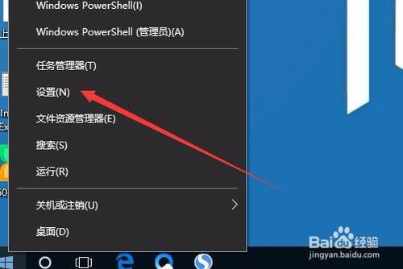
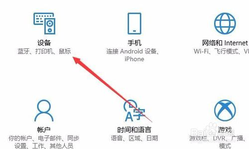
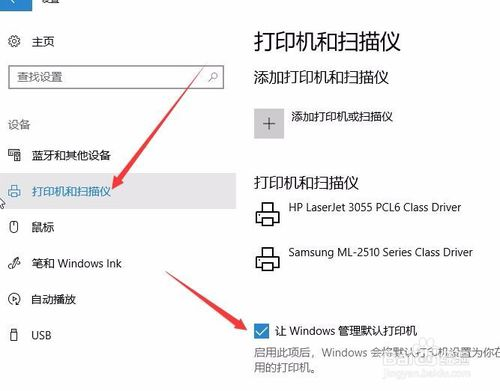
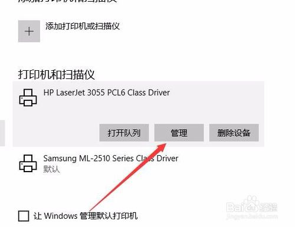
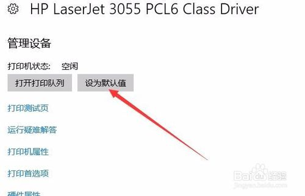
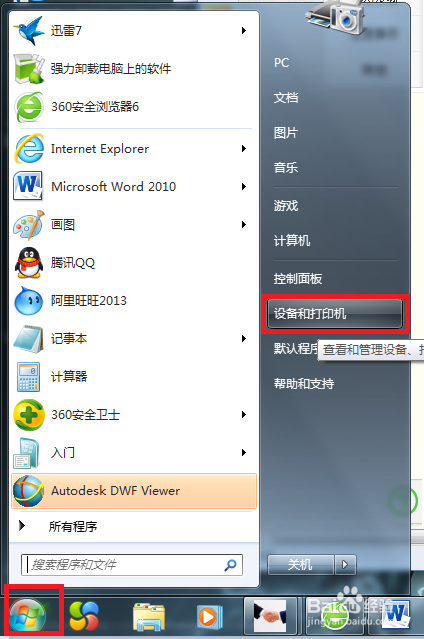
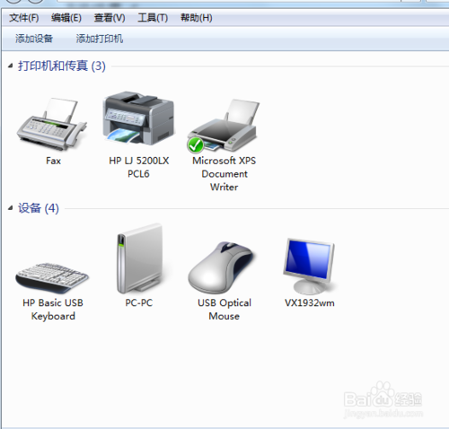
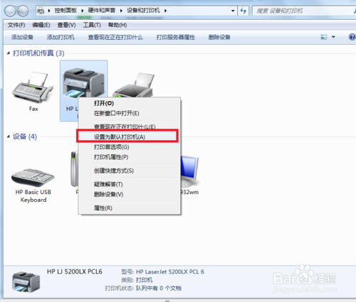
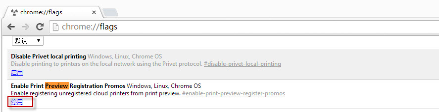
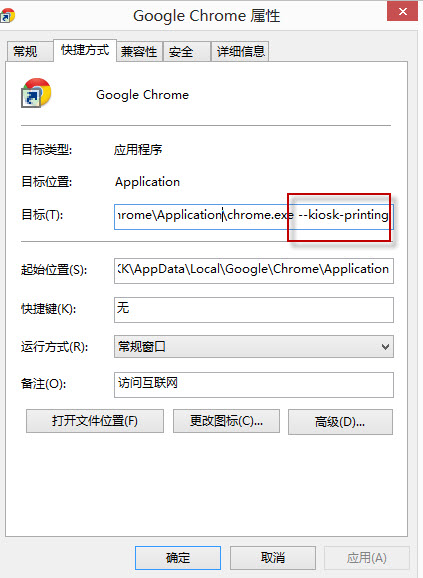

# 打印部署文档
* ### 前言
本文档介绍使用浏览器打印时进行静默打印，即直接打印不需点击预览页面
+ ### 部署环境

适用于Chrome浏览器稳定版，建议到[谷歌浏览器](https://www.google.com/intl/zh-HK/chrome/?brand=CHBD&gclid=EAIaIQobChMIrbfm97f04AIVEq6WCh2NlwHhEAAYASAAEgJBlvD_BwE&gclsrc=aw.ds)官方网站下载最新版本(注：大陆地区无法访问)。
* ### 部署配置

1. ##### Windows配置默认打印机
    本文档提供Windows 10与Windows 7配置默认打印机的方法
    * ###### Windows 10系统
        **1.在Windows10设置，右键点击桌面左下角的开始按钮，在弹出菜单中选择“设置”菜单项。**
        
         

        **2.这时会打开Windows设置窗口，点击“设备”图标。**

        
         

        **3.在打开的设备设置窗口，点击左侧边栏的“打印机和扫描仪”菜单项，原来在右侧窗口中取消“让Windows管理默认打印机”前面的复选框。**
        
        
         

        **4.这时点击上面打印机和扫描仪列表中要设置为默认的打印机，然后点击“管理”按钮。**
        
         

        **5.在打开的管理设备窗口中，点击“设为默认值”按钮，这样就可以把该打印机设置为默认打印机了。**
        
         

    * ###### Windows 7系统
        **1.开始——设备与打印机**

        
         

        **2.在弹出的界面里，选择需要设置为默认状态的打印机**

        
         

        **3.右键单击，勾选设置为默认打印机**

        
         
2. ##### Chrome浏览器设置
    在地址栏敲: chrome://:flags ,打开设置界面:
    
    停用:Enable Print Preview Registration Promos Windows, Linux, Chrome OS，如果没有这个选项可以跳过
    
    新建一个Chrome浏览器快捷方式，右键属性，在目标处增加空一格然后增加：--kiosk-printing
     

3. ##### 设置完成

### 参考资料
>Chrome静默打印及其它启动参数:[https://www.cnblogs.com/whoami3/p/10147746.html](https://www.cnblogs.com/whoami3/p/10147746.html)

>Win10系统设置或更改默认打印机:[https://jingyan.baidu.com/article/5553fa829ebf9265a23934db.html](https://jingyan.baidu.com/article/5553fa829ebf9265a23934db.html)

>Win7系统设置或更改默认打印机:[https://jingyan.baidu.com/article/5225f26b17b36be6fa0908bd.html](https://jingyan.baidu.com/article/5225f26b17b36be6fa0908bd.html)
